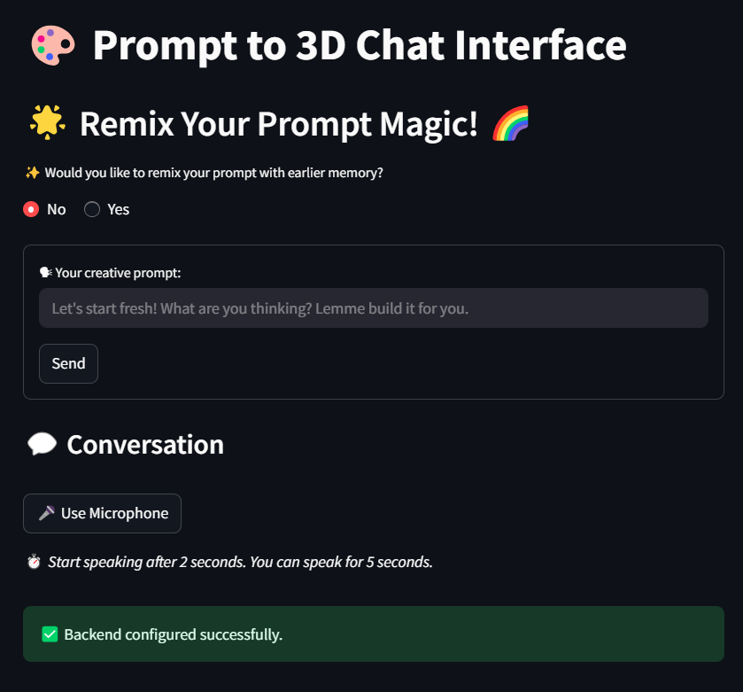
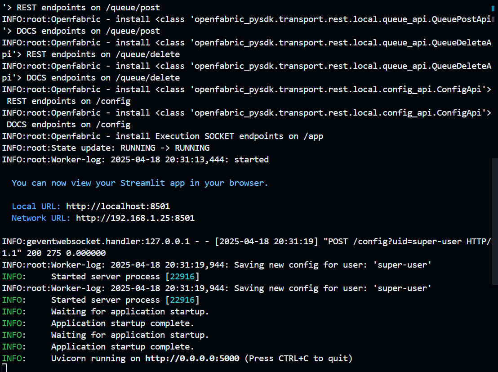
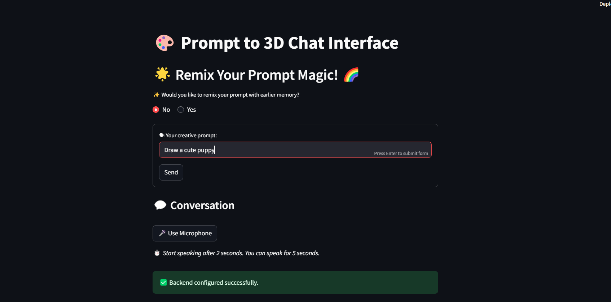
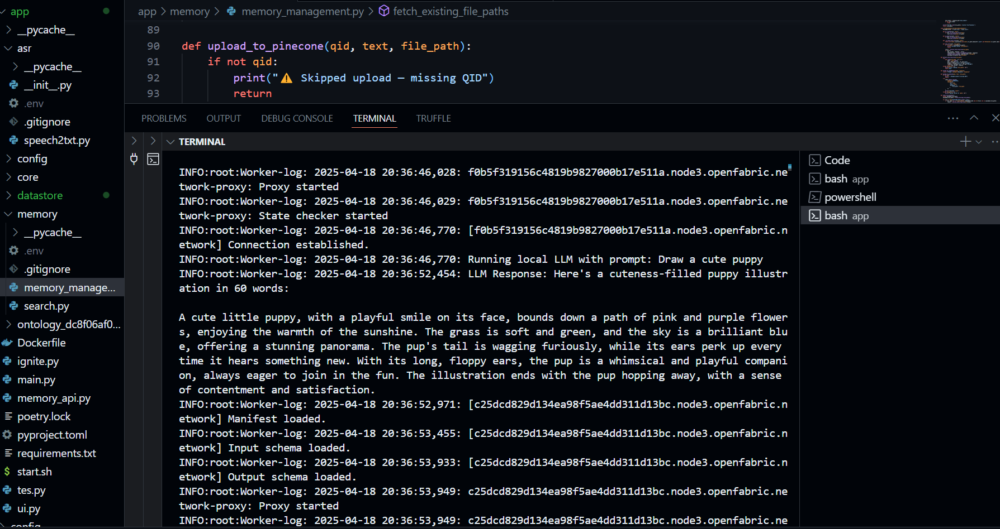
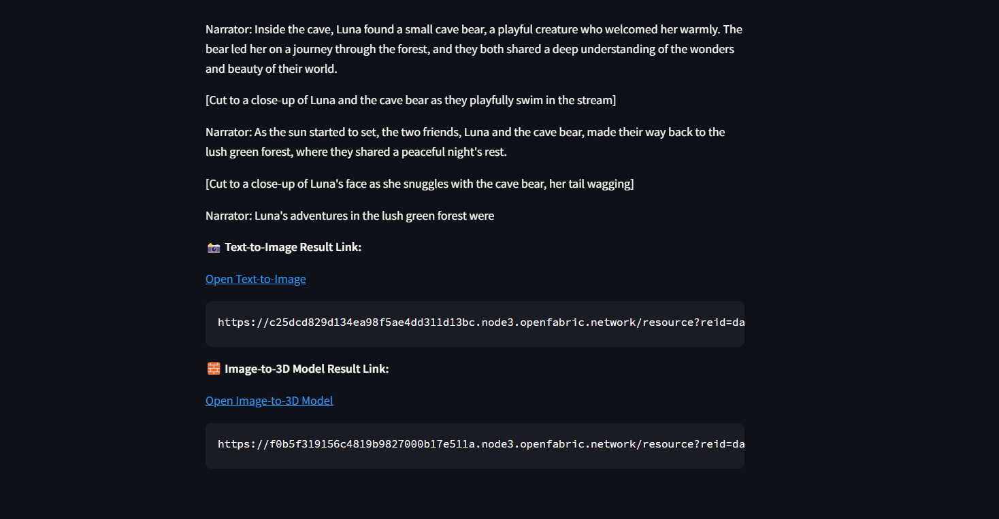
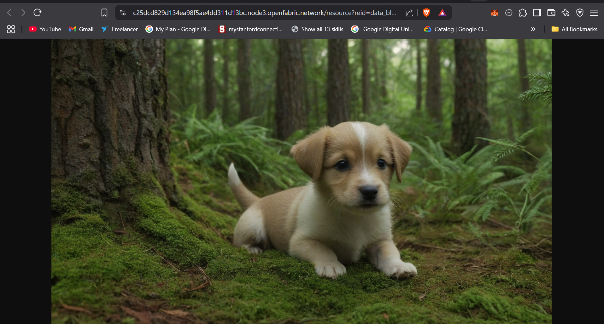
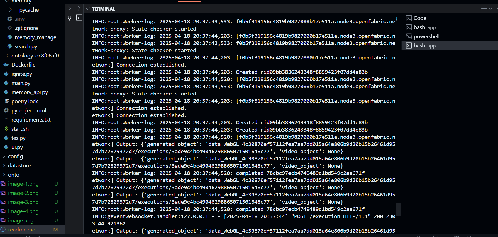
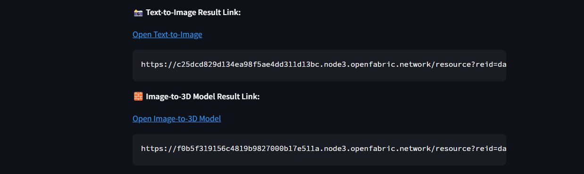
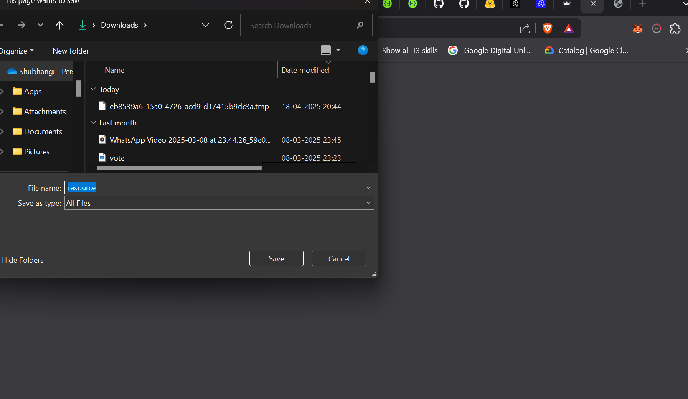

# 🌟 Overview

Welcome to my fully working solution for the **AI Developer Challenge**. This project transforms a simple text prompt into a **stunning image** and then into an **interactive 3D model**, all powered by a **local LLM** and the **Openfabric ecosystem**.

I have implemented **every single step outlined in the challenge**, including memory persistence and seamless app chaining. Read on to see how it all works 👇

---

## 🎯 The Mission — Fulfilled

### ✅ Step 1: Understand the User — Done

- Integrated a **locally hosted LLM**- tinyllama-1.1b-chat-v1.0.Q4_K_M.gguf
- Parses and expands the prompt with creativity 
- Generates visuals(Image and 3D) from the openfabric apps

### ✅ Step 2: Bring Ideas to Life — Completed

- **Text-to-Image App:**   
  Dynamically loaded using manifest + schema

- **Image-to-3D App:**   
  Output from the previous step is seamlessly passed here

- Both apps are invoked via `Stub` using Openfabric’s SDK

### ✅ Step 3: Remember Everything — Implemented

- **Short-Term Memory:** Managed in-session with context buffers
- **Long-Term Memory:** 
  - Persisted using **Pinecone** vector DB
  - File-based memory watcher (`watchdog`) implemented
  - Uploaded metadata and file content as vector embeddings
  - Fully indexed JSON files from `datastore/`
  - remix API when envoked looks for memory through the memory/search.py and finds the most similar prompt

- User recall example:
  > “Make it like the red dragon I did last week”  
  → System matches embeddings via Pinecone  
  → Uses context from past entries
  → retreives all data then calls the execution API which starts the local llm and the apps.

---

### Remix feature-
- The app asks you whether you want to remix you previous prompt with something new.
- If you select yes the vector similarity finds the closest prompt and remixes with the output generated earlier and the current user prompt.

## 🛠 Pipeline: Fully Connected

Streamlit interface opens
↓
Asks for remix (Say Yes or No) -> yes 
↓ No                               ↓
User Prompt (Collected in 2 ways - text and voice) -> Remixed prompt
↓                                                            ↓
Local LLM (LLaMA)              <-                 <-        <-
↓ 
Text-to-Image App (Openfabric) 
↓ 
Generated Image 
↓ 
Image-to-3D App (Openfabric) 
↓ 
3D Model Output 
↓ 
Synced to Pinecone for future memory

---

## 📂 Important files and explanation

### ✅ `main.py`

- Loaded through ignite.py and works on PORT 8888
- Entrypoint as per Openfabric SDK
- Uses `Stub` to connect both apps dynamically
- Prepares response and handles schema

### ✅ `ui.py`

- Works on streamlit PORT 8501
- Has the entire interface set up and API calls
- Calling the following APIs
   - Config
   - Execution
   - resource (for both apps to get resource urls)
   - remix (works on PORT 5000, takes care of remixing the prompt)
   - record_and_transcribe (for recording the audio and transcribing another model loaded via huggingface (openai/whisper-medium.en))

   

### ✅ `memory_api.py`

- For managing remix and record_and_transcribe api

### ✅ `memory/memory_managment.py`

- For syncing the Pinecone database with all the flatfiles being created.
- Stores all the data in the vectorDB to perform similarity search later and maintain context memory, as it is the best for context retreival 

### ✅ `memory/search.py`

- takes the current prompt and looks for the most similar prompt if used before
- Extracts: `qid`, `prompt`, `response`
- Sends it to the LLM for maintaining context in the next conversation.

## Execution API
### ✅ `core/local_llm.py`

- when the execution api executes this is executed first it sends the prompt to the local llm and gets the output.
- LLM used in this case is tinyllama-1.1b-chat-v1.0.Q4_K_M.ggu
(Okay, guilty here but, I dont like this LLM really, responses are not upto the mark but it is the most lightweight llm and therefore, saves on time and execution and doesn't become so heavy that it doesn't let execution API execute, a better LLM with this prompt could have been so much better but for my case for just the demo I would rather choose something faster and doesm't heat up my laptop (no gpu))

### ✅ `core/txt_to_img.py`

- Creates the pipeline for executing the openfabric app and stores the response

### ✅ `core/img_to_3d.py`

- Creates the pipeline for executing the openfabric app and stores the response

## Voice to text pipeline
### ✅ `asr/speech2txt.py`

- Takes the voice input and sends it to the LLM - openai/whisper-medium.en
- Gets the transciption and sends it via API

---

## 📦 Deliverables — All Present

- ✅ Fully working Python pipeline
- ✅ Prompt → Image → 3D output live
- ✅ Pinecone memory persistence
- ✅ file-based ingestion
- ✅ Logs in console (e.g., uploaded, skipped, error info)

---

## 🧠 Core Features

| Feature                 | Status   |
|------------------------|----------|
| Openfabric SDK         | ✅ Used   |
| Voice to text interaction| ✅ Done   |
| Local LLM integration  | ✅ Done   |
| Dynamic app execution  | ✅ Done   |
| Text to Image  | ✅ Done   |
| Image to 3D  | ✅ Done   |
| Streamlit gui interface| ✅ Done   |
| Clickable resource URLs in local browser| ✅ Done   |
| Pinecone long-term memory | ✅ Done   |
| Vector deduplication   | ✅ Done   |
| Session context        | ✅ Active |
| File sync + Watcher    | ✅ Done   |
| Proper logs            | ✅ Done   |

---

## 🚀 Bonus Points — Claimed

- ✅ visual GUI implemented with streamlit
- ✅ Clickable Assets links provided that open in local browser
- ✅ File Watcher for auto-indexing
- ✅ Pinecone vector similarity memory
- ✅ Voice to text interaction implemented

---

## ✨ Sample Prompt Experience

> “Create a glowing phoenix rising from ashes under the moonlight.”

→ Expanded and styled by local LLM  
→ Text-to-Image generates visuals  
→ Passed to Image-to-3D app  
→ 3D object returned  
→ Saved in Pinecone with unique QID for future reference  
→ Can be retrieved later with a vague prompt!

---

## 🧪 How to Run

### ✅ Local Execution

- 1. Clone the repository 
- 2. Install requirements.txt
- 3. bash start.sh
Voila! everything is working

✅ Code is original, modular, and clear.

✅ Fully working and testable

✅ Meets all checklist points

## Screenshots and logs

### bash start.sh starts all the ports the are up and running
- 

### Entering the prompt from ui and seeing the log for prompt to local llm
- UI
 - 
- LOG
 - 

### Text to image creation logs and clickable resource urls
- Clickable resouce urls
 - 
- Image opening in the local browser
 - 

### Image to 3d models
- Logs of creation
 - 
- Clickable link and url
 - 
- Gets downloaded but is empty due to the fault in the openfabric app
 - 

